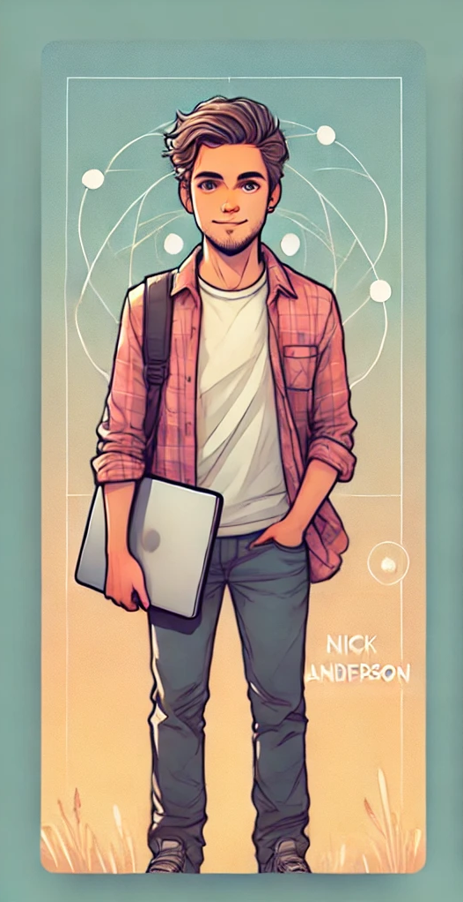

<h1>Nick Anderson</h1>

Software Engineer, Astrophysics & Philosophy Enthusiast

 

Halo 👋, I'm a Senior Software Engineer at <a href="https://konghq.com/">Kong, Inc.</a> on the Konnect Platform Services team (we call ourselves TPS). Ask me about our Authorization system, I designed it 🤓.

I have spent the past decade focusing on backend services and the tools necessary for seamless integration. My career began in systems administration and automation, and over time, I’ve developed a passion for building scalable, high-performance solutions. What drives me most is crafting solutions that not only meet technical requirements but also deliver meaningful, positive outcomes for end-users.

 

Connect with me on <a href="https://www.linkedin.com/in/iamnande/">LinkedIn</a>!

 

  <h2>Nerd Stats</h2>
  
  
   

  
  
  
  
  
  
  
  
  
  
  
  
  
  
  
  
  

 

  
  
  
  

